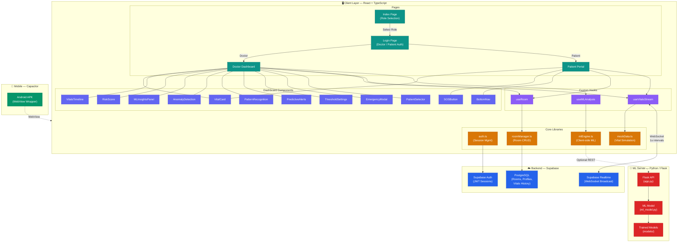
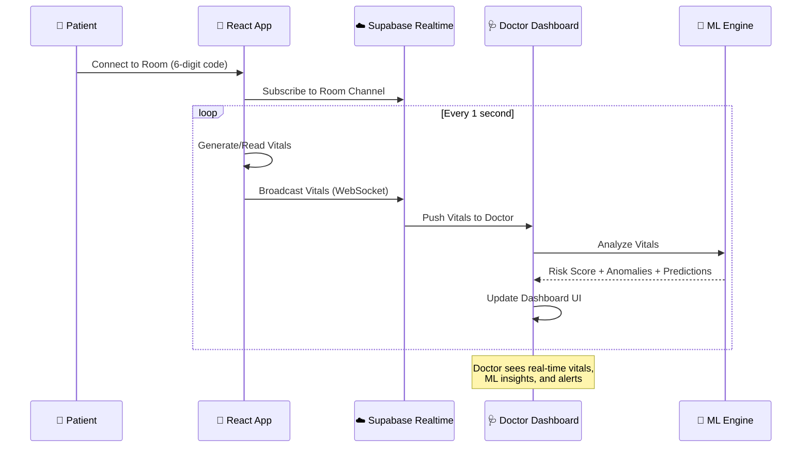

# VitalWatch — Remote Patient Monitoring IoT Agent

A **real-time, ML-powered remote patient monitoring system** built with React, TypeScript, and Supabase. Doctors create monitoring rooms and patients join with a 6-digit code to stream vitals in real-time across devices.

---

## 🏗️ System Architecture



### Architecture Overview

| Layer | Technology | Responsibility |
|---|---|---|
| **Frontend** | React 18 + TypeScript + Vite | SPA with role-based routing (Doctor/Patient) |
| **UI Framework** | Tailwind CSS + shadcn/ui | Glassmorphism cards, animations, responsive layout |
| **State & Data** | Custom Hooks + React Query | Room management, vitals streaming, ML analysis |
| **Client ML** | Custom mlEngine.ts | Z-score anomaly detection, trend prediction, pattern recognition |
| **Realtime** | Supabase Realtime Broadcast | WebSocket-based vital streaming at 1s intervals |
| **Database** | Supabase PostgreSQL | Rooms, user profiles, vitals history |
| **Auth** | Supabase Auth | JWT-based doctor/patient authentication |
| **ML Server** | Python Flask + scikit-learn | Server-side ML model inference (optional) |
| **Mobile** | Capacitor + Android WebView | Native Android APK wrapper |

### Data Flow



---

## ✨ Features

### 🏥 Room-Based Architecture
- **Doctor Dashboard** — Create monitoring rooms with unique 6-digit codes
- **Patient Portal** — Join rooms and stream vitals to the doctor
- **Cross-Device** — Works across different browsers/devices via Supabase Realtime Broadcast

### 🧠 ML-Powered Analysis (Client-Side)
- **Anomaly Detection** — Z-score and IQR methods to detect abnormal vital readings
- **Trend Prediction** — Linear regression with 5-step forecasting
- **Pattern Recognition** — Identifies clinical deterioration patterns (sepsis, respiratory distress, etc.)
- **Risk Scoring** — Composite ML-enhanced risk score (0-100)
- **AI Insights** — Natural language insights and recommendations

### 📡 Real-Time Data Streaming
- Vitals update every **1 second** via Supabase Realtime Broadcast (WebSocket)
- Heart Rate, Blood Pressure, SpO₂, Temperature, Respiratory Rate
- Live connection status indicators

### 🔐 Authentication
- Separate login/signup for Doctors and Patients
- Demo credentials for quick testing
- Session persistence via localStorage

### 🎨 Premium UI
- Glassmorphism cards with backdrop-blur
- Gradient color system (teal for doctors, gold for patients)
- Staggered entry animations and micro-interactions
- Responsive design for all screen sizes

---

## 🚀 Getting Started

### Prerequisites
- Node.js 18+
- A [Supabase](https://supabase.com) project

### 1. Clone & Install
```bash
git clone https://github.com/zorox06/vital-watch.git
cd vital-watch
npm install
```

### 2. Setup Supabase
Create a `.env` file in the root:
```env
VITE_SUPABASE_URL=https://your-project.supabase.co
VITE_SUPABASE_PUBLISHABLE_KEY=your-anon-key
```

Run the SQL setup in your Supabase SQL Editor:
```sql
-- See supabase-setup.sql for full script
```

### 3. Run
```bash
npm run dev
```
Open `http://localhost:8080`

---

## 🧪 Demo Credentials

| Role | Email | Password |
|---|---|---|
| Doctor | doctor@vitalwatch.com | doctor123 |
| Doctor | dr.chen@vitalwatch.com | chen123 |
| Patient | john@email.com | patient123 |
| Patient | sarah@email.com | patient123 |

## 🔄 How to Test

1. **Tab 1** → Select "I'm a Doctor" → Login → Create Monitoring Room → Note 6-digit code
2. **Tab 2** → Select "I'm a Patient" → Login → Enter room code → Connect
3. Patient vitals stream to doctor dashboard in real-time
4. Click **AI** tab on doctor dashboard for ML analysis

---

## 🛠 Tech Stack

| Technology | Purpose |
|---|---|
| React + TypeScript | Frontend framework |
| Vite | Build tool & dev server |
| Supabase | Database + Realtime Broadcast |
| Tailwind CSS | Styling |
| shadcn/ui | UI components |
| Recharts | Data visualization |
| Lucide React | Icons |
| Capacitor | Mobile (Android) wrapper |
| Python Flask | ML server backend |

## 📁 Project Structure

```
vital-watch/
├── src/
│   ├── pages/                  # Route pages
│   │   ├── Index.tsx           # Landing — role selection
│   │   ├── LoginPage.tsx       # Auth — doctor/patient login
│   │   ├── DoctorDashboard.tsx # Doctor monitoring view
│   │   └── PatientPortal.tsx   # Patient vitals streaming
│   ├── components/
│   │   ├── dashboard/          # 15 dashboard components
│   │   │   ├── VitalCard.tsx           # Individual vital display
│   │   │   ├── VitalsTimeline.tsx      # Historical chart
│   │   │   ├── RiskScore.tsx           # ML risk gauge
│   │   │   ├── MLInsightsPanel.tsx     # AI recommendations
│   │   │   ├── AnomalyDetection.tsx    # Anomaly alerts
│   │   │   ├── PatternRecognition.tsx  # Clinical patterns
│   │   │   ├── PredictiveAlerts.tsx    # Forecasting
│   │   │   ├── ThresholdSettings.tsx   # Alert thresholds
│   │   │   ├── EmergencyModal.tsx      # Emergency alerts
│   │   │   └── ...
│   │   └── ui/                 # 49 shadcn/ui components
│   ├── hooks/                  # Custom React hooks
│   │   ├── useRoom.ts          # Room create/join logic
│   │   ├── useVitalsStream.ts  # Real-time vitals via Supabase
│   │   └── useMLAnalysis.ts    # ML engine integration
│   ├── lib/                    # Core business logic
│   │   ├── mlEngine.ts         # Client-side ML algorithms
│   │   ├── roomManager.ts      # Room CRUD operations
│   │   ├── auth.ts             # Authentication helpers
│   │   └── mockData.ts         # Vital data simulation
│   └── integrations/supabase/  # Supabase client & types
├── ml-server/                  # Python ML backend
│   ├── app.py                  # Flask REST API
│   ├── ml_model.py             # ML model logic
│   └── models/                 # Trained model files
├── android/                    # Capacitor Android project
├── supabase/                   # Supabase config
└── package.json
```

## 🧠 ML Algorithms

- **Z-Score Anomaly Detection** — Flags readings >2σ from the mean
- **IQR Outlier Detection** — Uses interquartile range for robust outlier identification
- **Linear Regression** — Fits trend lines and predicts 5 future values
- **Pattern Matching** — Heuristic rules for clinical patterns (sepsis, cardiac, respiratory)
- **Composite Risk Score** — Weighted combination of all ML signals

---

## 📄 License

MIT
